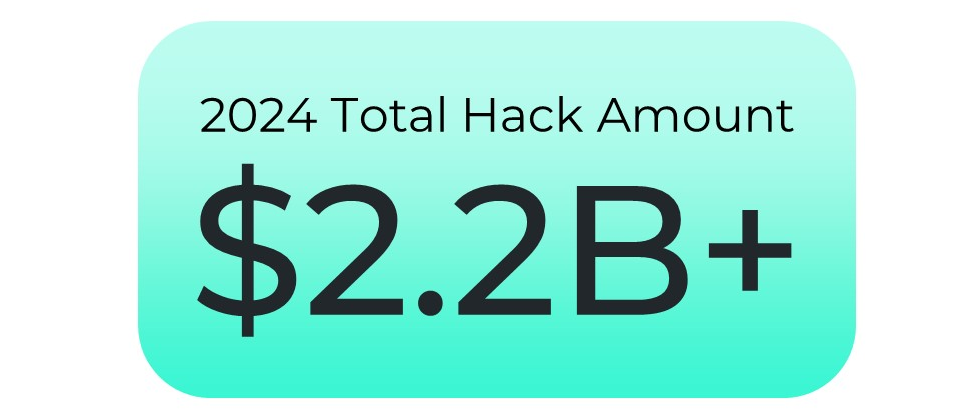

# 2024 Web3 Security Landscape Report 
2024 marked a significant turning point in the Web3 security landscape, showcasing both strides in resilience and persistent challenges. In 2024, cyberattacks on the Web3 industry led to losses exceeding $2.2 billion, with approximately 309 reported incidents. These attacks showcased a wide range of threats, underscoring the crucial need for continued vigilance within the Web3 community.

# Table of Contents

1. [Hacks: A Year of Contrasting Trends](#hacks-a-year-of-contrasting-trends)
2. [Vulnerabilities: Web3 Security Snapshot 2024](#vulnerabilities-web3-security-snapshot-2024)
   - [Exit Scams](#exit-scams)
   - [Access Control Issues](#access-control-issues)
   - [Phishing](#phishing)
   - [Flash Loan Attacks](#flash-loan-attacks)
   - [Reentrancy](#reentrancy)
   - [Oracle Issues](#oracle-issues)
   - [Contract Vulnerability](#contract-vulnerability)
   - [Other Vulnerabilities](#other-vulnerabilities)
3. [Top 10 Hacks of 2024: Overview and Impact](#top-10-hacks-of-2024-overview-and-impact)
   - [Chris Larsen (XRP): A Personal Fortune Drained](#chris-larsen-xrp-a-personal-fortune-drained)
   - [PlayDapp: Access Control Compromised](#playdapp-access-control-compromised)
   - [Bitforex: Exchange Under Siege](#bitforex-exchange-under-siege)
   - [DMM Bitcoin: A Massive Crypto Heist](#dmm-bitcoin-a-massive-crypto-heist)
   - [Munchables: Gaming on Thin Ice](#munchables-gaming-on-thin-ice)
   - [BtcTurk: Turkish Exchange's Hot Wallet Heat](#btcturk-turkish-exchanges-hot-wallet-heat)
   - [WazirX: A Trust Betrayed](#wazirx-a-trust-betrayed)
   - [btc user: A Mysterious Loss](#btc-user-a-mysterious-loss)
   - [0xf2b8: A Significant Address Breached](#0xf2b8-a-significant-address-breached)
   - [Radiant Capital: DeFi's Dark Day](#radiant-capital-defis-dark-day)
4. [Conclusion: Navigating a Secure Future](#conclusion-navigating-a-secure-future)

# Hacks: A Year of Contrasting Trends

2024 witnessed a noteworthy increase in overall losses, and high-profile exploits echoed loudly. DMM Bitcoin's staggering $305 million loss in May, followed by PlayDapp ($290 million in February) and WazirX ($230 million in July), underscores persistent threats targeting Exchanges and DeFi protocols.

A detailed analysis of monthly exploit losses in 2024 reveals notable patterns. February emerged as the most devastating month, with losses peaking at $406.9M, significantly outpacing all other months. May and August also recorded substantial losses, reaching $359.89M and $309.02M respectively, underscoring heightened vulnerabilities during these periods. In stark contrast, December saw a dramatic decline to just $3M, potentially reflecting improved security measures and heightened vigilance.

# Vulnerabilities: Web3 Security Snapshot 2024

## **Exit Scams**

Exit scams accounted for 21% of attacks, with numerous incidents resulting in a loss of $161 million. Notable examples include Bitforex, which disappeared with $56.5 million, and ZKasino, which executed a rug pull worth $33 million.

* Safety Measures:

  * Thoroughly researching projects and teams, ensuring they have a solid track record and prioritizing projects with transparent security assessment by reputable firms. 

  * Be cautious of projects promising unrealistically high returns, and diversify your investments. 

## **Access Control Issues**

Access control issues represented 15% of attacks, with several incidents leading to a substantial loss of $843 million. Notable examples include the WazirX wallet compromise, resulting in a $230 million loss, and the PlayDapp access control breach, which led to a $290 million loss.

* Safety Measures:
  * Implement robust authentication and authorization mechanisms, adhere to the principle of least privilege, and regularly update access permissions. Additionally, conduct ongoing security training for employees, especially those with high privileges, and establish comprehensive monitoring systems to promptly detect and respond to any suspicious activities across infrastructure and applications.

## **Phishing**

Phishing incidents constituted 5% of attacks, with multiple incidents resulting in a loss of $319 million. Attackers used sophisticated phishing techniques, as seen in the $238 million loss by aka ***btc user*** and the $55.47 million phishing attack on 0xf2b8.

* Safety Measures:
  * The web3 space has seen a surge in front-end attacks due to projects overlooking the importance of front-end security. Conducting [Web3 penetration testing](https://salusec.io/penetration-testing) is crucial to identify vulnerabilities and weaknesses in your system that phishers could exploit. Prioritize user education, promote the use of hardware wallets and multi-factor authentication (MFA), and employ email verification and domain monitoring.

## **Flash Loan Attacks**

Flash loan attacks contributed to 8% of the attacks, with various incidents leading to a loss of $105 million. Notable examples include the Hedgey flash loan attack, which resulted in a $44.7 million loss, and the Sonne Finance attack, which caused a $20 million loss.

* Safety Measures: 
  * Mitigate flash loan risks by implementing restrictions like maximum borrowing amounts and time limits. Introducing fees for flash loan usage can raise the cost for attackers, acting as a deterrent against malicious exploits.

## **Reentrancy**

Reentrancy vulnerabilities accounted for 2% of attacks, with a few incidents resulting in a loss of $356,860. The MintRisesPrices attack on BSC, which resulted in a $59,000 loss, highlighted the impact of reentrancy vulnerabilities.

* Safety Measures: 
  * Reentrancy is common and stubbornly persistent in smart contracts. Despite its prevalence, we still encounter projects getting tripped up by it. This vulnerability can often be mitigated through a thorough [smart contract audit](https://salusec.io/audit), underscoring the importance of selecting experienced and responsible auditors.
  * Strictly Adhere to the Check-Effect-Interaction Model: Always run necessary checks and validations first. Only after passing these checks should you perform state changes, and interactions with external entities should come last.
  * Implement Comprehensive Reentry Protection: Apply this to every function involving sensitive operations within the contract.

## **Oracle Issues** 

Oracle issues constituted 3% of attacks, with a handful of incidents leading to a loss of $11 million. The Rho Markets oracle misconfiguration, resulting in a $7.6 million loss, showcased the exploitation of oracle vulnerabilities.

* Safety Measures:
  * Markets with shallow liquidity should not be used for price predictions.
  * Before considering specific price oracle plans, first assess whether the token's liquidity is sufficient to ensure integration with your platform.
  * Increase the attacker's manipulation cost through Time-Weighted Average Price (TWAP).

## **Contract Vulnerability**

Contract vulnerabilities were the most common attack vector at 26%, with numerous incidents. These attacks exploited weaknesses in smart contract code, leading to unauthorized fund transfers or other manipulations, with a total loss of $179 million. Notable examples include the UwU lend contract vulnerability, resulting in a $19.3 million loss, and the Holograph vulnerability, which led to a $14.4 million loss.

* Safety Measures:
  * Conduct thorough smart contract audits by reputable auditors.
  * Implement rigorous testing and secure coding practices.
  * Use emergency stop mechanisms and continuous monitoring for swift response to threats.

## **Other Vulnerabilities**

Other vulnerabilities represented 20% of attacks, resulting in the largest financial losses. The most significant incident was the DMM Bitcoin hack, where it remains unclear how the attackers managed to steal funds from the exchange.

# Top 10 Hacks of 2024: Overview and Impact

The top 10 hacks of 2024, representing more than 45% of the year's total losses (over $1.5 billion), highlighted ongoing vulnerabilities in private key management and access control. These attacks were distributed across the year, with a significant concentration in August, witnessing multiple high-value incidents. The Lazarus Group's participation was evident in several cases, launching complex attacks mainly against individual crypto holders and exchange platforms.

## Chris Larsen (XRP): A Personal Fortune Drained

On January 30, 2024, Chris Larsen, co-founder of Ripple, fell victim to a hack where approximately $112.5 million worth of XRP was stolen from his personal wallets. This incident not only highlighted the personal security risks for high-profile individuals in the crypto space but also sparked a broader discussion on securing private keys for significant holdings.

## PlayDapp: Access Control Compromised

On February 1, 2024, PlayDapp experienced a devastating exploit where attackers gained control through an access control vulnerability, leading to a $290 million loss in ETH. This breach underscored the critical need for stringent access controls in blockchain gaming platforms, prompting a swift overhaul of security protocols.

## Bitforex: Exchange Under Siege

On February 23, 2024, Bitforex suffered a significant attack with hackers siphoning off $56.5 million. The sudden disappearance of this exchange from the scene raised questions about the integrity and transparency of crypto exchanges, urging the community to advocate for more robust regulatory frameworks.

## DMM Bitcoin: A Massive Crypto Heist

On May 31, 2024, DMM Bitcoin, a prominent Japanese exchange, was hit by a cyberattack resulting in the theft of $305 million in Bitcoin. This incident was linked to the Lazarus Group, emphasizing the global reach of cyber threats and the necessity for enhanced security measures in major exchanges.

## Munchables: Gaming on Thin Ice

On March 27, 2024, Munchables, a platform on the Blast network, faced a hack where $62.3 million was stolen. This highlighted the vulnerabilities within new blockchain gaming ecosystems, especially those leveraging innovative but less-tested layer solutions.

## BtcTurk: Turkish Exchange's Hot Wallet Heat

On June 22, 2024, BtcTurk was compromised, losing $55 million due to vulnerabilities in its hot wallet system. This event served as a reminder of the inherent risks of maintaining significant liquidity in online wallets, pushing for a shift towards more secure, offline storage solutions.

## WazirX: A Trust Betrayed

On July 18, 2024, WazirX, one of India's leading crypto exchanges, faced a cyberattack resulting in a $230 million loss. The incident involved the compromise of multi-signature wallets, leading to immediate community distrust and a call for stronger security and transparency in crypto exchanges.

## btc user: A Mysterious Loss

On August 19, 2024, an individual known only as "btc user" lost $238 million in Bitcoin. This case was particularly enigmatic due to the anonymity of the victim, raising questions about individual security practices and the ease with which large sums can be moved in the crypto world.

## 0xf2b8: A Significant Address Breached

On August 20, 2024, one user lost $55.43 million of MakerDAO stablecoin DAI after signing a phishing transaction that changed the ownership of the proxy contract holding the funds. The victim, 0xf2B8, executed a “setOwner” transaction, granting control of the contract to a phishing address, 0x0000db. The scammer had authorized 0x5D4b to drain all the DAI in the wallet. This is one of the biggest losses to a phishing scam this year. This incident highlighted the risks associated with high-value addresses on public blockchains and the need for better privacy and security measures for individual wallet holders.

## Radiant Capital: DeFi's Dark Day

On October 16, 2024, Radiant Capital, a DeFi lending protocol, was exploited, losing $50 million. The attack was identified as highly sophisticated, involving malware injection into developers' hardware wallets, revealing the escalating complexity of threats against DeFi platforms and the imperative for advanced security protocols.

# Conclusion: Navigating a Secure Future

2024 has witnessed a notable increase in total losses compared to the previous year, highlighting a critical need for advanced security protocols within the Web3 space. The concentration of losses in the top 10 hacks of the year underscores the vulnerability of even the most established platforms to sophisticated cyber threats. This distribution of incidents across various attack vectors calls for a comprehensive strategy to fortify the Web3 ecosystem.

The prevalence of flash loan exploits, private key compromises, and smart contract vulnerabilities, particularly those associated with state-sponsored actors like the Lazarus Group, signals an urgent requirement for more robust security practices. **Rigorous auditing**, alongside proactive **penetration testing**, must become standard to combat these evolving threats. As we move forward, the community must rally around platforms that not only meet user demands but also demonstrate an unwavering commitment to security excellence. This commitment is essential to fostering trust and ensuring the long-term viability and safety of the Web3 landscape.